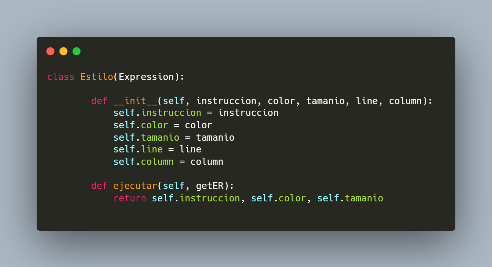
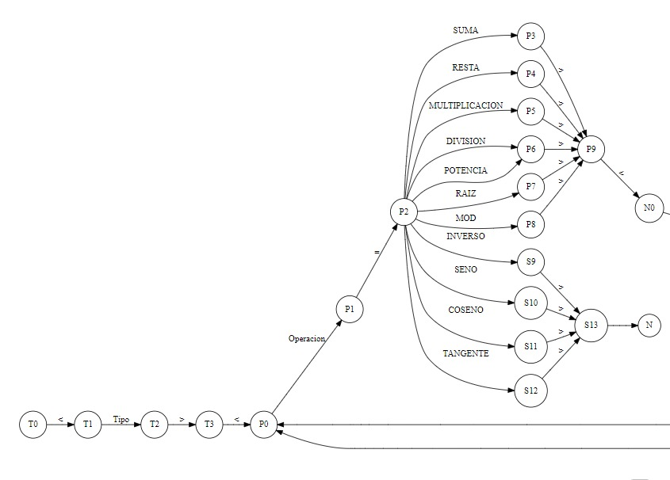
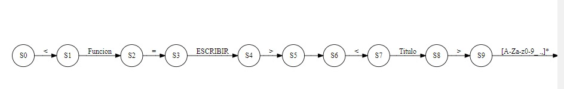
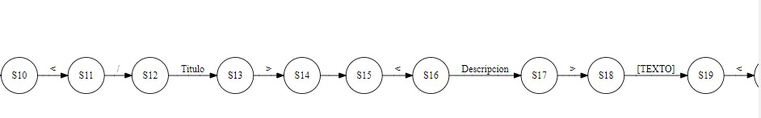

# **Manual Técnico**

Requisitos minimos del Sistema Operativo para ejecutar el programa:

- Windows 10 (8u51 y superiores)
- Windows 8.x (escritorio)
- Windows 7 SP1
- Windows Vista SP2
- RAM: 128MB
- Espacio en Disco: 124 MB para python
- Procesador: Minimo Pentium 2 a 266 M

## **Descripción General**

Se solicita la lectura de código fuente, creando un programa el cual sea capaz de identificar un lenguaje dado, identificando los errores léxicos y ejecutando las instrucciones correspondientes.

Se listarán una serie de instrucciones las cuales deben de ser ejecutadas, cumpliendo con el formato asignado, generándolo en un archivo HTML.

De igual manera, se deberán de manejar los errores encontrados por medio de un archivo HTML.

## **Paradigma de Programación**

Todo el desarrollo del programa esta basado en el paradigma de programacion orientado a objetos, esto es, un modelo o un estilo de programación que proporciona unas guías acerca de cómo trabajar con él y que está basado en el concepto de clases y objetos.

Es por ello que durante toda la realizacion del programa se implemento el uso de clases, clases abstractas y objetos de las mismas.

## **Diccionario de librerías**

### Libreria Tkinter:
- Tkinter es una libreria que funciona para la creación y el desarrollo de aplicaciones de escritorio. Esta librería facilita el posicionamiento y desarrollo de una interfaz gráfica de escritorio con python. TK se describe a sí mismo como el único toolkit o kit de herramientas para el desarrollo de una interfaz gráfica de usuario.

### Módulo "os"
- Este módulo provee una manera versátil de usar funcionalidades dependientes del sistema operativo. Si se desea manipular rutas, se realiza gracias al modulo os.path

### Módulo "enum"
- El módulo enum define un tipo de enumeración con capacidades de iteración y comparación. Puede ser usado para creae símbolos bien definidos para valores, en lugar de usar enteros literales o cadenas

### Módulo "webbrowser"
- El módulo webbrowser proporciona una interfaz de alto nivel que permite mostrar documentos basados en web a los usuarios. En la mayoría de circunstancias, simplemente llamar a la función open() desde este módulo hará lo correcto.

### Módulo "abc"
- Este módulo proporciona la infraestructura para definir clases de base abstracta (CBAs) en Python

### Librería "math"
- Este módulo proporciona acceso a las funciones matemáticas definidas en el estándar de C. Estas funciones no pueden ser usadas con números complejos; usa las funciones con el mismo nombre del módulo cmath si requieres soporte para números complejos.

## Diccionario de Variables Globales

Se inicializa una lista global, la cual es la encargada de almacenar todos los errores encontrado al analizar el archivo.

- errores_ = [ ] - Esta lista almacena una serie de objetos, los cuales contienen, el lexema, tipo, fila y columna de cada error, analizado en el programa.

- self.file = None - Esta variable es la encargada de almacenar la ruta del archivo que ha sido abierto, para poder manejarlo de manera global durante todo el programa.

## **Diccionario de Clases**

### **Class App**

La clase App es la clase principal, la cual hereda de la clase Tk.tk, la cual es necesaria para crear la ventana principal en donde se añaden todas las demas ventanas para formar toda la ingerfaz grafica del programa, ademas de iniciar la variable self.file

### **Class Aritmeticas**

La clase Aritmeticas, es la encargada de realizar cada una de las operaciones que pueden venir en el archivo de entrada. Realizando operaciones como suma, resta, multiplicacion, division, etc. Como tambien operaciones trigonometricas, como por ejemplo: seno, coseno, tangente.

### **Class Generador**

La clase Generador, es la encargada de generar la expresion regular de las operaciones para visualizar su contenido de manera mas intuitiva y elegante al usuario.

### **Class Expression**

La clase expression es una de las mas importantes, ya que es la encargada de inicializar todas las clases abstractas dentro del programa, y asi manejar una recursividad dentro de las operaciones y numeros, que se agregan en el archivo de entrada.

### **Class Estilo**

La clase estilo, es una clase abstracta, que hereda de la clase Expresion. Esta tiene la unica finalidad de almacenar en objetos todos los datos pertenecientes a la funcion de Estilo contenidos en filas y columnas en el archivo de entrada.

### **Class Texto**

La clase Texto, es una clase abstracta, que hereda de la clase Expresion. Esta tiene la unica finalidad de almacenar en objetos todos los datos pertenciencas a la funcion de Texto. contenidos en filas y columnas en el archivo de entrada.

### **Class HtmlFile**

La clase HtmlFile, es la encargada de recibir los atributos que se le han enviado desde el analizador lexico, con el unico fin de generar un archivo html que sea legible e intuitivo para el usuario, transformando toda la informacion en este lenguaje, y asi poder generar un archivo html, implementando el modulo webbrowser.

## **Diccionario de Funciones**

### **Función openFile**

La función openFile, añade a la variable global self.file, la ruta del archivo que se va abrir al momento de llamar al modulo filedialog(). Posteriormente verifica que el archivo que se va abrir sea con extension LFP, de lo contrario, no se podra abrir ningun archivo.

Esta funcion es la encargada de añadir todo el contenido del archivo en el area de texto, que se encuentra en el programa.

### **Función saveFile**

Esta funcion es la encargada de guardar los cambios que se hagan en el area de texto, en el archivo original que ha sido abierto, guardando todo con el mismo nombre de archivo.

### **Función save_asFile**

Esta funcion abre un cuadro de dialogo, el cual sirve para guardar un archivo con otro nombre o con el mismo nombre del archivo original, dentro de cualquier parte del ordenador.

### **Función parseFile**

Primeramente esta función es la encargada de verificar que dentro del area de texto se encuentre un archivo por analizar, con la estructura indicada.

Posteriormente crea una variable y se la envia al analizador lexico, para la generacion de tokens, y lexemas que se utilizaran a lo largo de todo el programa.

Luego mediante iteraciones se obtienen cada uno de los parametros pertencientes a Tipo, Funcion y Texto que se encuentran en el archivo de entrada, y alamcena sus datos en listas nativas, para enviarselos al modulo de generacion de archivos html.

### **Función parse_errores_file**

Esta funcion es la encargada primeramente de verificar que el area de texto no se encuentre vacia. Posterior a ello, itera en la lista de errores global que ha sido creada en el analizador lexico. Esto con el fin de poder mandar esta lista a la clase html, y poder generar la tabla necesaria para verificar cada uno de los errores pertenecientes en el archivo de entrada.

## Automatas finitos deterministas

### **Tipo:**

### **Estilo:**

### **Funcion:**

Dichos automatas fueron generados con la unica finalidad de expresar como es el fucionamiento del lenguaje utilizado en el programa referente a las etiquetas de Tipo, Texto y Funcion, que vienen dentro del archivo, juntamente con su estructura a analizar, es por ello que se presentan los automatas finitos deterministas de cada una de las etiquetas asi como sus respectivos estados y transiciones.

