# Analizador Léxico

Dentro de la Universidad de San Carlos de Guatemala se le solicitó a los estudiantes del laboratorio de Lenguajes Formales y de Programación, la elaboracion de un programa el cual sea capaz de identificar un lenguaje dado, identificando errores léxicos y ejecutando las instrucciones correspondientes.

Dicho programa Tiene la capacidad de interactuar con el usuario mediante un archivo de entrada el cual contiene un formato especifico, para que este sea capaz de analizar su contenido y mostrar el resultado de ciertas operaciones trigonométricas y aritméticas.

Ademas del analisis de dicho archivo, el prograa es capaz de generar un archivo de visualizacion de resultados en formato hmtl, ademas de cada uno de los errores lexicos econtrados dentro del programa.

Tiene la capacidad de poder guardar archivos con el mismo nombre o distinto dentro del ordenador.

## Menu Principal

Cuenta con interfaz sencilla y minimalista, que le permite al usuario ciertas funciones basicas y detallas del programa, entre ellas: Abrir un archivo, Guardar, Guardar como, Ver detalles de ayuda, y salir del propio programa.

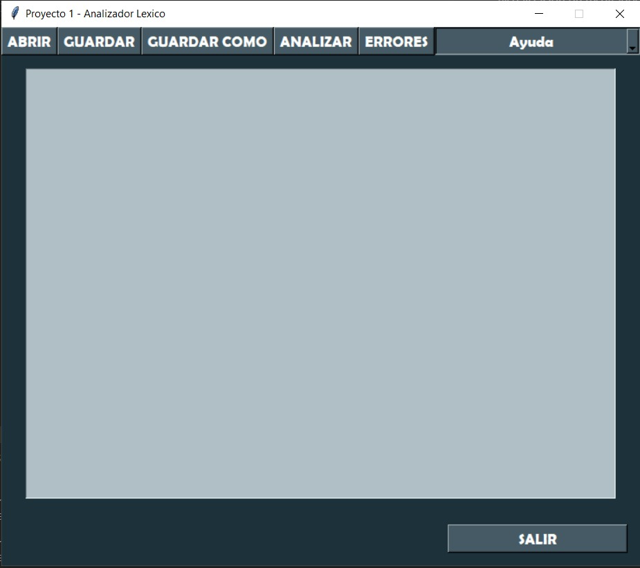

Ademas de las funcionalidades, cuenta con un area de texto o del programa en el que el usuario podra verificar el contenido del archivo abierto en pantalla para su uso intuitivo y sencillo del manejo del archivo.

## Ventana Abrir

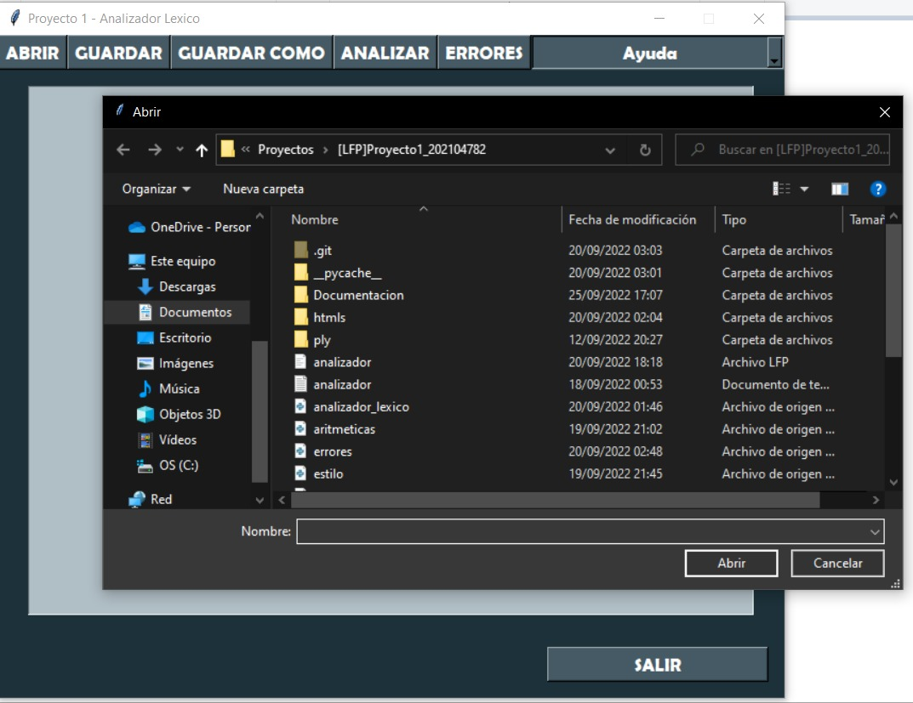

Al presionar el boton abrir, se desplega un cuadro de dialogo, en el que el usuario podra seleccionar cualquier tipo de archivo, unicamente con la restriccion detallada, que el tipo de archivo que acepta el programa es unicamente con extensi+on "LFP". Cualquier otro tipo de archivo, no se podra cargar en el sistema.

## Opciones Guardar y Guardar Como

Al abrir algun archivo que sea con el formato que acepta el programa se debera visualizar de la siguiente manera:

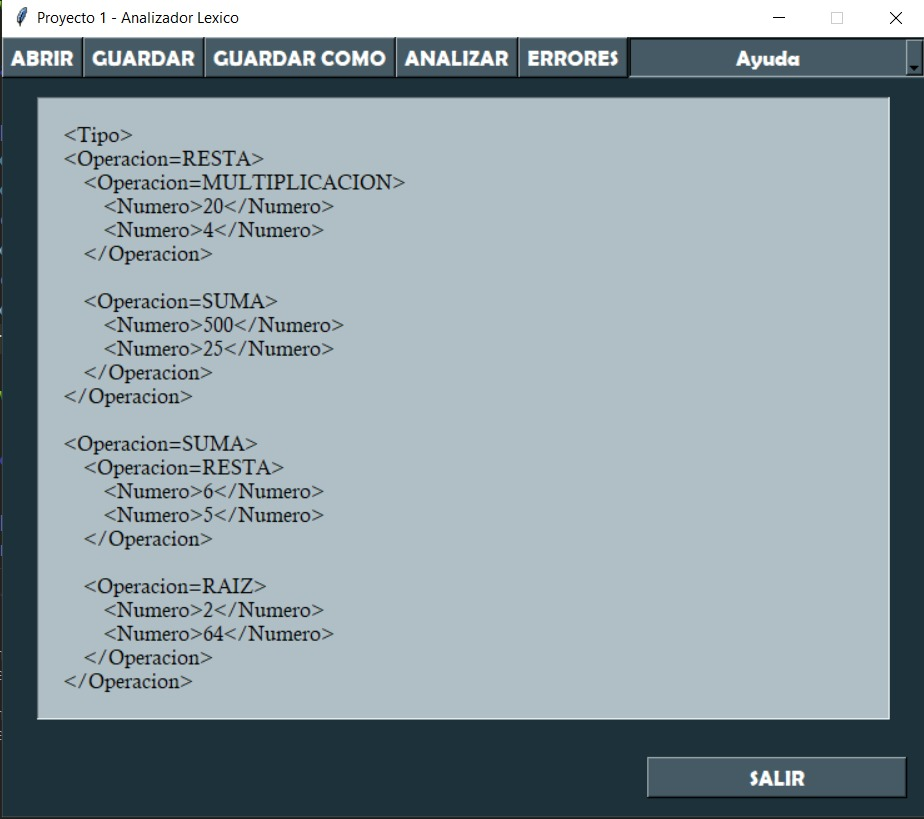

Basicamente se muestra todo el resultado del archivo abierto, dentro del area de texto, en el cual el usuario podra editar, si asi lo desea.

Entre las opciones de guardado:

- **Guardar**: Al presionar el boton Guardar, el programa automaticamente guarda los cambios realizados en el area de texto, en el archivo abierto, con el mismo nombre con el cual ha sido abierto.

    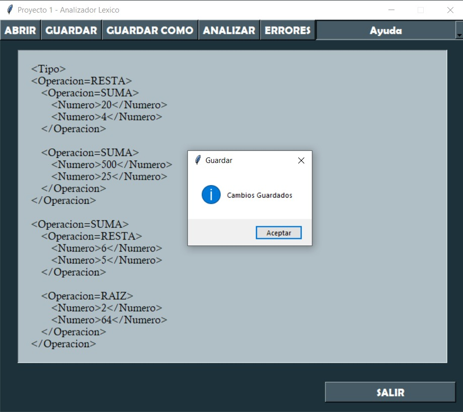

- **Guardar Como**: Al presionar el boton Guardar Como, se visualizara un cuadro de dialogo en el cual podremos guardar el archivo actual en cualquier parte de nuestro ordenador, con cualquier nombre que nosotros deseemos, o con el mismo nombre con el que ha sido abierto, con el unico detalle que al guardarlo con el mismo nombre reemplazara el archivo actual.

## Boton Analizar

Al presionar el botón "Analizar", el programa analizara el contenido actual en el area de texto, y automaticamente generara un archivo html, que se encontrara visible en la carpeta "htmls", con un nombre especifico.

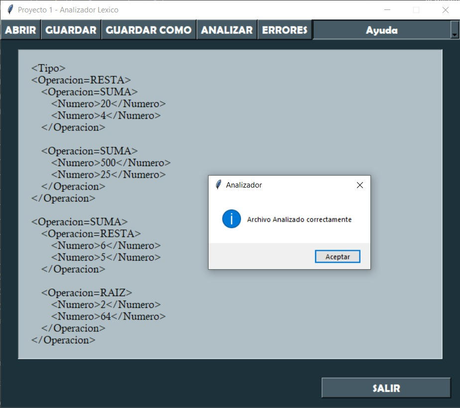

Y en la carpeta se verificara de la siguiente manera: 

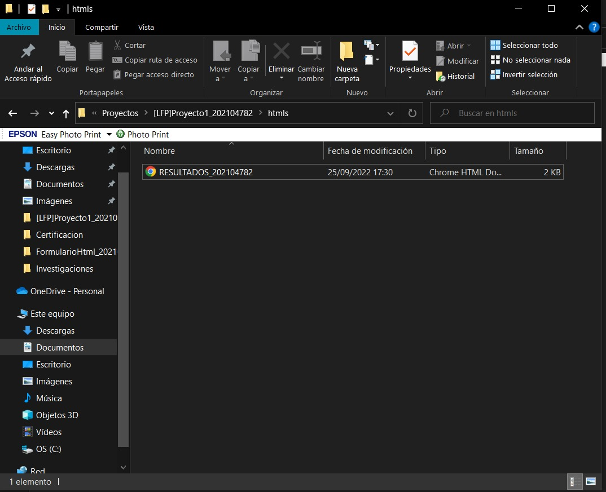

## Boton Errores

Al presionar el botón "Errores", el programa analizara cada uno de los errores en cualquier parte del contenido visible en el archivo de texto y automaticamente generara un archivo html, con el nombbre ERRORES_202104782

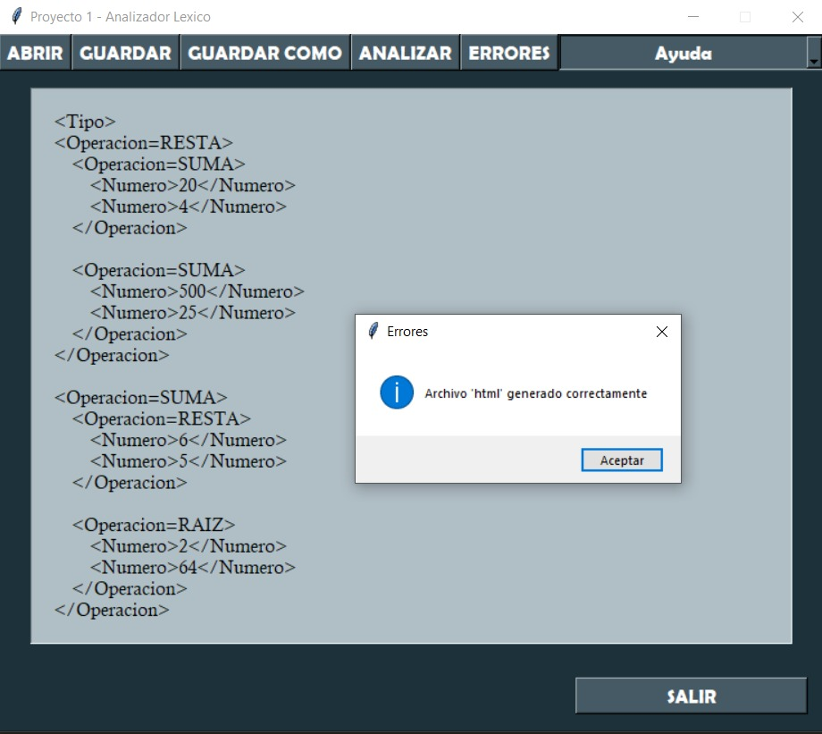

Y en la carpeta se verificara de la siguiente manera: 

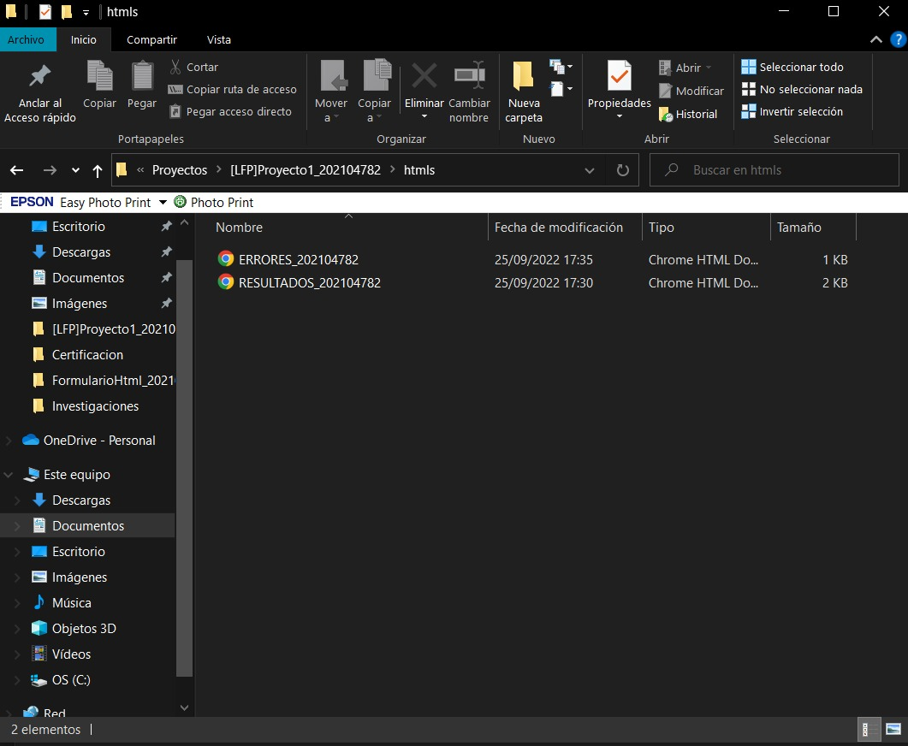

## Resultados

Los resultados de ambos archivos generados, seran en formato html, y se verificaran en promedio de esta manera:

- RESULTADOS:
    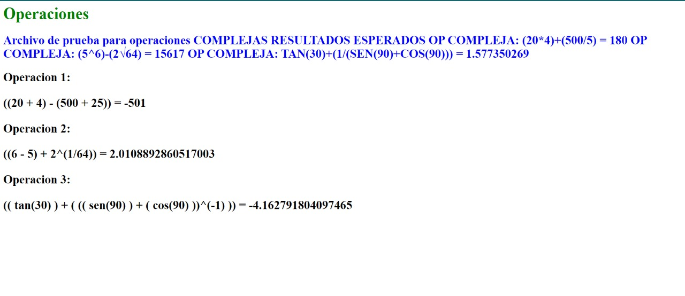

- ERRORES:
    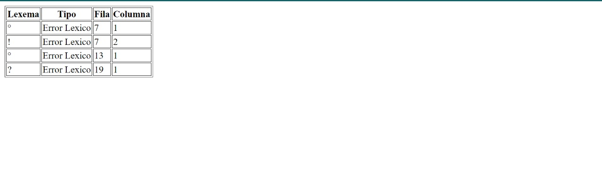

## Ayuda

El programa ademas cuenta con las opciones de ayuda, en las que simplemente se encontrar los manuales tecnico y de usuario, para ayudar al usuario, asimismo del apartado para verificar los derechos del autor del programa.

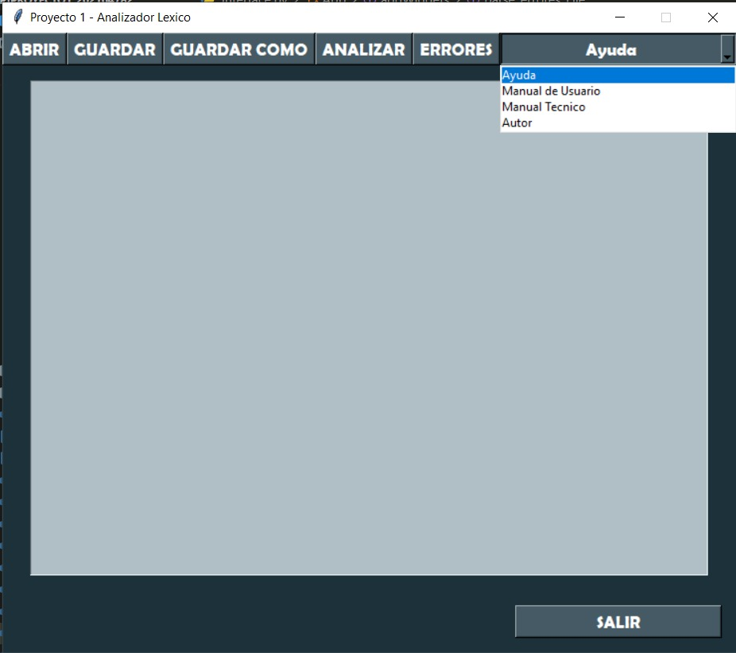

- Autor:
    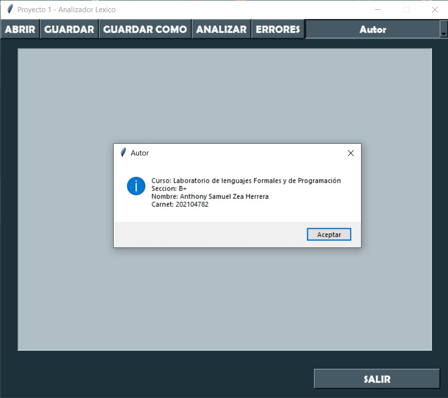

- Manual de usuario:
    Al presionar esta opcion se verificara el manual de usuario

- Manual tecnico:
    Al presionar esta opcion se verificara el manual tecnico.
    
## Salir
Por ultimo, el usuario podra salir del programa totalmente simplemente presionando el boton "Salir".